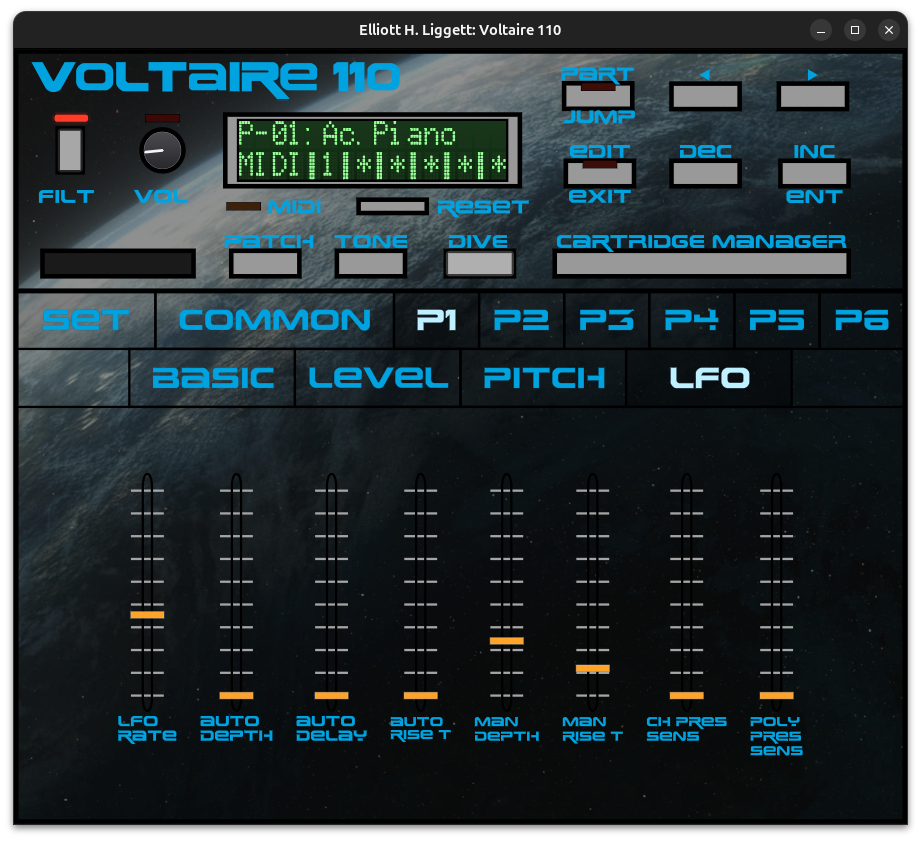

# Voltaire 110

An emulator of the classic Roland U-110 rompler. 



## What is it? 

The Voltaire 110 audio plugin emulates the CPU and other chips of the Roland U-110 in software. This emulation produces nearly identical audio to that of the original hardware. The emulation includes the complete (and awful) original user interface 2-line display, as well as a built-in patch/part editor. 

## Requirements

Voltaire 110 currently supports Linux and Windows. On Linux, the plugin formats are LV2 and CLAP. On Windows, just CLAP. In theory, a macOS version can be built as well, although I have not tried this as I don't have a macOS developer license. 

## How to get it

Click ["Releases"](https://github.com/eliggett/emu110/releases) and download the latest release. You'll also need to either dump your U-110 ROM EPROMs or obtain the rom files some other way -- please understand that I cannot distribute them. You need version 2.03 of the ROM file, as well as the four WAVE ROM files. You can also add any SN-U110-XX files, which will represent the cartridges (cards). The primary ROM file must be named "U110v203.BIN". Cartridge files may be named SN-U110-XX.bin. 

### Windows install: 
Copy the CLAP file to `C:\Program Files\Common Files\CLAP\Voltaire110.clap`
Copy the ROM files (all of them) to: `C:\Users\<your username>\AppData\Local\Voltaire110\roms\`

Now tell your DAW to rescan for plugins. 

If the plugin doesn't boot, click the LCD screen for debug. 

### Linux install:
Copy the LV2:
```bash
mkdir ~/.lv2
cp -r ~/Downloads/Voltaire110.lv2 ~/.lv2/
```

Copy the CLAP file:

```bash
mkdir ~/.clap
cp ~/Downloads/Voltaire110.clap ~/.clap/
```

Copy the ROM files: 

```bash
mkdir -p ~/.local/share/Voltaire110/roms
cp ~/Downloads/Roland/U110v203.BIN ~/.local/share/Voltaire110/roms/
cp ~/Downloads/Roland/roland_t110_u110_u220_waverom*.bin ~/.local/share/Voltaire110/roms/
cp ~/Downloads/Roland/*sn-u110* ~/.local/share/Voltaire110/roms/
```

Now tell your DAW to rescan for plugins. 

If the plugin doesn't boot, click the LCD screen for debug. 
